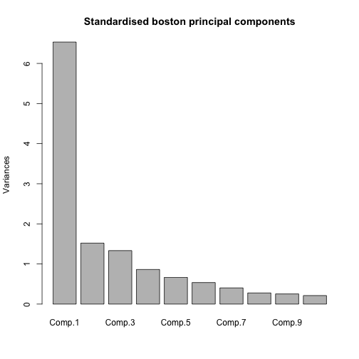
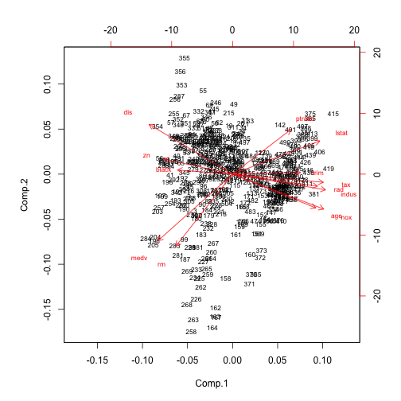
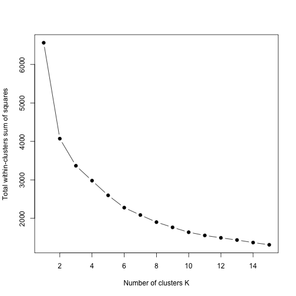
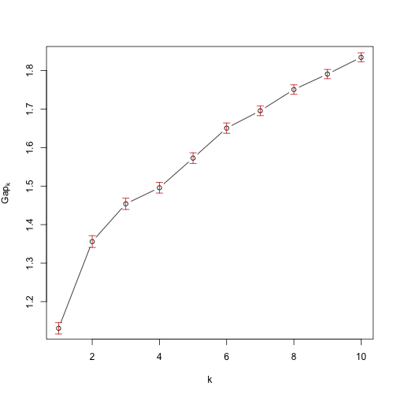

# Exercise 1

Run K-means for the Olive Oil data with K = 3 and K = 9 with scaled
and unscaled data. Assuming that the macro-areas are the “true” clusters for K = 3,
use table to compare the macro-areas with the clustering. Do you think that these
are good clustering results in terms of matching the macro-areas? Why? Does the
clustering on scaled or unscaled data look better?
Do the same for the regions and the K = 9-clustering.

# Exercise 2 
On Moodle you can find the data set Boston.dat. This data set contains
information collected by the U.S Census Service concerning housing in the area of
Boston Mass. The data was originally published by Harrison, D. and Rubinfeld,
D.L. ‘Hedonic prices and the demand for clean air’, J. Environ. Economics &
Management, vol.5, 81-102, 1978.

# Exercise 3
“kmeans++” is the name of a method to initialise the k-means algorithm
that has been proposed in the literature. Do some research on the internet, find out
and explain how this works. It can be run by the following function kmpp, where X
is a data matrix and k is the number of clusters. The output is of the same format
as kmeans.

# EXERCISE 1

```r
library(pdfCluster)
data(oliveoil)
olive <- oliveoil[,3:10]
str(olive)
###unscaled k=3
set.seed(665544)
olivek3 <- kmeans(olive,centers=3,nstart=100)
olivek3$centers
table(olivek3$cluster,oliveoil$macro.area)

###scaled k=3

solive=scale(olive)
set.seed(665544)
solivek3 <- kmeans(solive,centers=3,nstart=100)
solivek3$centers
```

```r
table(olivek3$cluster,oliveoil$macro.area)
```

```
##    
##     South Sardinia Centre.North
##   1    42        0          134
##   2   190       22            0
##   3    91       76           17
```

```r
table(solivek3$cluster,oliveoil$macro.area)
```

```
##    
##     South Sardinia Centre.North
##   1     2        0          121
##   2   102       98           30
##   3   219        0            0
```

Analyzing the output of the second table (the one concerning the scaled data), we can see that we have a pretty good clustering result in terms of matching the macro-areas, in fact the first cluster represents the Centre-North area, the second one Sardinia and the South and the third one the South. We can't say the same for the unscaled data, looking at the first table we can state that the clusters are more impure in terms of macro-area, so we can conclude that the clustering on scaled data looks better.

```r
### unscaled k=9
set.seed(665544)
olivek9 <- kmeans(olive,centers=9,nstart=100)
olivek9$centers


#scaled k=9
set.seed(665544)
solivek9 <- kmeans(solive,centers=9,nstart=100)
solivek9$centers
```


```r
table(olivek9$cluster,oliveoil$region)
```

```
##    
##     Apulia.north Calabria Apulia.south Sicily Sardinia.inland Sardinia.coast Liguria.east
##   1            2        0            0      5               0              0            0
##   2            0        0           75      2               0              0            0
##   3            0        0            3      1              65              0            0
##   4           13        0            0      2               0              0           16
##   5            0        3           77      7               0              0            0
##   6            1       48            5     11               0              0            2
##   7            9        5            0      7               0              0           32
##   8            0        0           30      1               0              0            0
##   9            0        0           16      0               0             33            0
##    
##     Liguria.west Umbria
##   1           39      0
##   2            0      0
##   3            3      0
##   4            2     51
##   5            0      0
##   6            1      0
##   7            5      0
##   8            0      0
##   9            0      0
```

```r
table(solivek9$cluster,oliveoil$region)
```

```
##    
##     Apulia.north Calabria Apulia.south Sicily Sardinia.inland Sardinia.coast Liguria.east
##   1            0        1            0      0               0              0           33
##   2            0        0          144      0               0              0            0
##   3            2       32           12     16               0              0            0
##   4            1        0            0      0               0              0            7
##   5            0        0           49      2               0              0            0
##   6            0        0            0      0               0              0           10
##   7            0        0            0      0              65             33            0
##   8            0       23            1     12               0              0            0
##   9           22        0            0      6               0              0            0
##    
##     Liguria.west Umbria
##   1            0      1
##   2            0      0
##   3            0      0
##   4            0     50
##   5            0      0
##   6           50      0
##   7            0      0
##   8            0      0
##   9            0      0
```

Again the results of the scaled data seem to produce a better result in terms of matching the clusters to the regions. Just to make some examples the second and fifth clusters represent south Apulia, the fourth one Umbria and so on.


# EXERCISE 2

```r
boston<-read.table("Boston.dat.txt",header = T,sep="")
str(boston)

bostonk=boston[,-4]
str(bostonk) 
sboston<-scale(bostonk)

sprboston<- princomp(sboston)
```


```r
plot(sprboston,main="Standardised boston principal components")
```



It seems like most of the variance is explained by the first two components.


```r
biplot(sprboston,cex=0.7) 
```


From this grapgh it's very hard to infer the number of clusters, we squeezed 10 dimensions in just two, so useful information can be hidden by this representation.


```r
set.seed(665544)
k_sboston<-kmeans(sboston,centers=2,nstart=100)

table(k_sboston$cluster,boston$chas)
```

```
##    
##       0   1
##   1 306  23
##   2 165  12
```

It's clear that the clusters don't match the position with respect to the Charles River.


```r
unique(boston$rad)
```

```
## [1]  1  2  3  5  4  8  6  7 24
```

```r
set.seed(665544)
k_sboston<-kmeans(sboston,centers=9,nstart=100)
table(k_sboston$cluster,boston$rad)
```

```
##    
##      1  2  3  4  5  6  7  8 24
##   1  0  0  0  0  0  0  0  0 93
##   2  0  7  0 20  0  0  0  0  0
##   3  5  5  7 41 30 17  0  9  0
##   4  0  0  0  0 26  0  0  0  0
##   5  0  0  0  0  0  0  0  0  7
##   6  0  0  0  0  0  0  0  0 32
##   7  5  1 19 33 24  6 13  6  0
##   8 10  6  6 16 14  3  2  0  0
##   9  0  5  6  0 21  0  2  9  0
```
Again the clusters do't match the index of accessibility to radial highways.


```r
k.max<-15

set.seed(665544)
wss <- sapply(1:k.max, 
              function(k){kmeans(sboston, k, nstart=50,iter.max = 15 )$tot.withinss})
plot(1:k.max, wss,
     type="b", pch = 19, frame = T, 
     xlab="Number of clusters K",
     ylab="Total within-clusters sum of squares")
```



```r
set.seed(665544)

k_sboston<-kmeans(sboston,centers=6,nstart=100)
k_sboston$centers
```

```
##         crim         zn      indus        nox         rm        age        dis        rad
## 1 -0.3677617 -0.1194496 -0.7750979 -0.2070531  1.7944798  0.1365198 -0.2863064 -0.5224844
## 2  0.6929440 -0.4872402  1.0149946  1.0216034 -0.3763315  0.7436817 -0.7971829  1.6596029
## 3 -0.2752848 -0.4872402  1.5394464  1.1404612 -0.6293350  0.9317916 -0.8992920 -0.6113281
## 4 -0.4126505  1.9668142 -1.0879098 -1.1469310  0.6206357 -1.3938537  1.5325661 -0.6274061
## 5  1.9150206 -0.4872402  1.0149946  1.0028242 -0.3672475  0.7784542 -0.8836165  1.6596029
## 6 -0.3886544 -0.3271655 -0.4747172 -0.4734673 -0.2479791 -0.2163235  0.2312508 -0.5760795
##           tax    ptratio      black      lstat       medv
## 1 -0.80597768 -1.1270390  0.3439742 -1.0132569  1.8540225
## 2  1.52941294  0.8057784  0.1937867  0.6605220 -0.4759511
## 3  0.01572139 -0.3664154 -0.1300128  0.6810140 -0.5090584
## 4 -0.58844857 -0.7042530  0.3550824 -0.9112802  0.6794177
## 5  1.52941294  0.8057784 -2.9248199  1.2292552 -1.1044570
## 6 -0.60914057  0.1067616  0.3169979 -0.1365216 -0.1206050
```

Now I tried to use the elbow method in order to find a reasonoble number of clusters such that adding another one doesn't give a much better modeling to the data. Here the cutoff point it's not very evident so I opted for 6 as number of clusters. The reason for this decision is that after that point the total within sum of squares decreases linearly with respect to the number of clusters. The important consideration I need to make is that this method doesn't provide us a clear solution to the problem of finding a reasonable number of clusters.


```r
library(cluster)
set.seed(123)
cg1 <- clusGap(sboston,kmeans,K.max = 10,B=100,d.power=2,spaceH0="scaledPCA",nstart=100)
```

```
## Clustering k = 1,2,..., K.max (= 10): .. done
## Bootstrapping, b = 1,2,..., B (= 100)  [one "." per sample]:
## .................................................. 50 
## .................................................. 100
```

```r
print(cg1,method="globalSEmax",SE.factor=2)
```

```
## Clustering Gap statistic ["clusGap"] from call:
## clusGap(x = sboston, FUNcluster = kmeans, K.max = 10, B = 100,     d.power = 2, spaceH0 = "scaledPCA", nstart = 100)
## B=100 simulated reference sets, k = 1..10; spaceH0="scaledPCA"
##  --> Number of clusters (method 'globalSEmax', SE.factor=2): 10
##           logW   E.logW      gap     SE.sim
##  [1,] 8.096361 9.227110 1.130749 0.01467028
##  [2,] 7.618666 8.974640 1.355974 0.01532226
##  [3,] 7.428542 8.882528 1.453986 0.01472996
##  [4,] 7.306337 8.802123 1.495786 0.01390586
##  [5,] 7.169246 8.741877 1.572631 0.01372456
##  [6,] 7.037923 8.688391 1.650468 0.01337081
##  [7,] 6.949827 8.645454 1.695627 0.01265985
##  [8,] 6.856551 8.607175 1.750624 0.01227514
##  [9,] 6.782685 8.573535 1.790850 0.01197451
## [10,] 6.708932 8.543197 1.834265 0.01181739
```

```r
print(cg1,method="Tibs2001SEmax",SE.factor=2)
```

```
## Clustering Gap statistic ["clusGap"] from call:
## clusGap(x = sboston, FUNcluster = kmeans, K.max = 10, B = 100,     d.power = 2, spaceH0 = "scaledPCA", nstart = 100)
## B=100 simulated reference sets, k = 1..10; spaceH0="scaledPCA"
##  --> Number of clusters (method 'Tibs2001SEmax', SE.factor=2): 10
##           logW   E.logW      gap     SE.sim
##  [1,] 8.096361 9.227110 1.130749 0.01467028
##  [2,] 7.618666 8.974640 1.355974 0.01532226
##  [3,] 7.428542 8.882528 1.453986 0.01472996
##  [4,] 7.306337 8.802123 1.495786 0.01390586
##  [5,] 7.169246 8.741877 1.572631 0.01372456
##  [6,] 7.037923 8.688391 1.650468 0.01337081
##  [7,] 6.949827 8.645454 1.695627 0.01265985
##  [8,] 6.856551 8.607175 1.750624 0.01227514
##  [9,] 6.782685 8.573535 1.790850 0.01197451
## [10,] 6.708932 8.543197 1.834265 0.01181739
```

```r
plot(cg1,main="")
```


Again this method doesn't let us make a clear interpretation about the number of clusters. The "globalSEmax" and  "Tibs2001SEmax" criterion indicate that the number of clusters should be ten, but simply they are suggesting the solution with most clusters. 


# EXERCISE 2

The "kmeans++" method is an improvement of the basic one because it entroduces a smarter initialization of the centroids. By definition this are the steps of the algorithm:

1)Randomly select the first centroid from the data points.

2)For each data point compute its distance from the nearest, previously chosen centroid.

3)Select the next centroid from the data points such that the probability of choosing a point as centroid is directly proportional to its distance from the nearest, previously chosen centroid. (i.e. the point having maximum distance from the nearest centroid is most likely to be selected next as a centroid)

4)Repeat steps 2 and 3 untill k centroids have been sampled 

The main idea of the algorithm is to initiliaze the centroids such that they are as far as possible from each other and this increases the chance that they will lie in different clusters. Using "kmeans++" makes the start of the algorithm more computationally demanding, but it also makes the convergence faster.


```r
set.seed(123466)
k_sboston<-kmeans(sboston,centers=6,nstart=100)

library(pracma)
kmpp <- function(X, k) {
  n <- nrow(X)
  C <- numeric(k)
  C[1] <- sample(1:n, 1)
  for (i in 2:k) {
    dm <- distmat(X, X[C, ])
    pr <- apply(dm, 1, min); pr[C] <- 0
    C[i] <- sample(1:n, 1, prob = pr)
  }
  kmeans(X, X[C, ])
}
set.seed(665544)

kmpp.sboston<-kmpp(sboston,6)
kmpp.sboston$tot.withinss
```

```
## [1] 2278.039
```

```r
k_sboston$tot.withinss
```

```
## [1] 2277.714
```

As we can see the Total within-cluster sum of squares obtained from kmeans is slightly less then the one of kmeans++. This can be interpreted as an unexpected result but the reason of this lies in the fact that we set "nstart"=100 so the randomness of the initialization of the algorithm and the resulting problems are downsized. Let's try with "nstart=1"

```r
set.seed(123466)
k_sboston<-kmeans(sboston,centers=6,nstart=1)
kmpp.sboston$tot.withinss
```

```
## [1] 2278.039
```

```r
k_sboston$tot.withinss
```

```
## [1] 2425.159
```

Now it's clear that the Total within-cluster sum of squares is 
substantially greater in the case of kmeans
